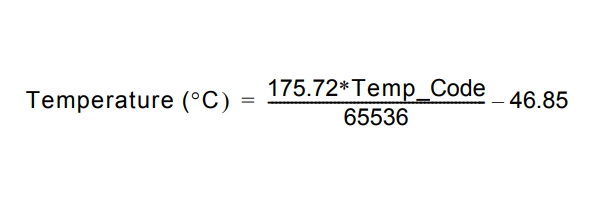

## Inter-Integrated Circuit (I2C)

I2C is a multi-master, multi-slave, half-duplex serial communication protocol that is commonly used for
inter-chip communication; for example, between a microcontroller and a sensor. In this tutorial we will use GreatFET One to interface with a
an I2C temperature and humidity sensor, the SI7021 from Silicon Labs.

Many types sensors are available on breakout boards from Adafruit and other websites, the specific part I'm using is the Adafruit Si7021 Temperature & Humidity Sensor Breakout Board
(Product ID: 3251) Depending on the sensor you are using, the commands you will need to send may differ from the example below but the principle and method will remain the same. 

You can use jumper wires to connect a breakout board to the following pins on GreatFET One:

* clock: J2 pin 40 (SCL)
* data: J2 pin 39 (SDA)
* VCC (5.0 V): J2 pin 2
* GND (ground): J2 pin 1

Before we dive in to writing some Python we can use the i2c scan utility to figure out the I2C address of the sensor:

```terminal
gf i2c --scan
```

This returns a list of working I2C addresses and a table representing the address space

```terminal
******** W/R bit set at each valid address ********
     0  1  2  3  4  5  6  7  8  9  a  b  c  d  e  f
00: W- -- -- -- -- -- -- -- -- -- -- -- -- -- -- --
10: -- -- -- -- -- -- -- -- -- -- -- -- -- -- -- --
20: -- -- -- -- -- -- -- -- -- -- -- -- -- -- -- --
30: -- -- -- -- -- -- -- -- -- -- -- -- -- -- -- --
40: WR -- -- -- -- -- -- -- -- -- -- -- -- -- -- --
50: -- -- -- -- -- -- -- -- -- -- -- -- -- -- -- --
60: -- -- -- -- -- -- -- -- -- -- -- -- -- -- -- --
70: -- -- -- -- -- -- -- -- -- -- -- -- -- -- -- --
```
The 7-bit base slave address of the SI7021 is 0x40, and is read write

Open an interactive Python shell:

```terminal
gf shell
```
It is advisable to first send the reset command 0xfe

```python
gf.i2c.write(0x40, [0xfe])
```
Now we can send the measure temperature command 0xf3

```python
gf.i2c.write(0x40, [0xf3])
```
And read the two byte temperature code

```python
gf.i2c.read(0x40, 2)
```

from these bytes the temperature can be calculated according to the equation in the SI7021 datasheet.



The short program below can be used to measure the temperature and print the results to the terminal!

```python
import time
from greatfet import GreatFET

# define some commands
TEMPERATURE = [0xf3]		# Measure Temperature, No clock stretching
_RESET 		= [0xfe]	    # Reset

# set the target address 
ADDRESS     =  0x40

# define a function to calculate temperature in degrees Celsius
def calculate_temp(tempCode: int):
    # calculation of temperature from SI7021 datasheet
    temp = (175.72*(int(tempCode[0] << 8) + int(tempCode[1]))/65536) - 46.85
    return temp

# Create an instance of the GreatFET object
gf = GreatFET()

# send a reset command
gf.i2c.write(ADDRESS, _RESET)

# wait for reset to complete
time.sleep(0.2)

while(1):
    # command a temperature measurement
    gf.i2c.write(ADDRESS, TEMPERATURE)

    # wait for measurement to complete
    time.sleep(0.2)

    # read the temperature code (as a tuple)
    tempCode = gf.i2c.read(ADDRESS, 3)

    # convert the temperature code to degrees Celsius and print it
    temperature = calculate_temp([tempCode[0][0],tempCode[0][1]])
    print('Temperature: %0.2f C' % temperature)
```
